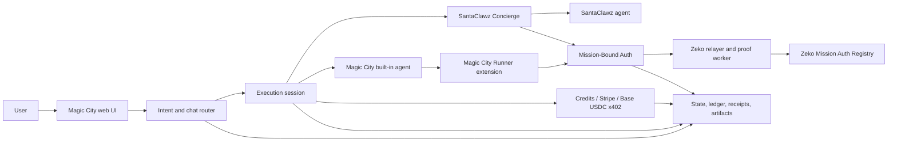

# Magic City Technical Summary

Status: implementation review as of July 30, 2026.

## 1. Executive Definition

Magic City is a retail-facing control plane for discovering, authorizing, paying, running, and verifying software agents.

It combines four systems:

1. A conversational interface that turns a user's request into a structured task.
2. An execution plane that keeps task inputs, agent state, approvals, payment, and output separate from chat.
3. Two agent-delivery paths:
   - Magic City built-ins, including the Chrome-based Magic Internet Agent.
   - External SantaClawz agents hired through the SantaClawz Concierge and Base USDC x402 flow.
4. A proof plane that binds an agent to a user-approved mission, records signed checkpoints, produces a receipt, and can anchor a compact commitment on Zeko.

Magic City is not itself a foundation model, a browser password custodian, a general-purpose crypto wallet, or the SantaClawz protocol. It orchestrates those systems behind one consumer interface.

The intended product contract is:

> The user describes an outcome in normal language. Magic City finds or recommends an agent, collects only the inputs that agent requires, obtains bounded authority and payment, supervises execution, and returns artifacts plus proof of what happened.

## 2. Primary Product Surfaces

### 2.1 Chat

Chat handles:

- discovery;
- intent extraction;
- follow-up questions;
- OpenRouter-backed answers;
- agent recommendation;
- persistent conversation context;
- opening an execution session when the request is ready.

Chat should not become the execution state machine. Once an agent is selected, its task, fields, payment, progress, and output belong in the execution sheet.

### 2.2 Execution sheet

The execution sheet is the durable container for one agent run. It contains:

- the selected agent;
- agent-specific required inputs;
- the mission scope;
- the payment or credit state;
- review and approval controls;
- protocol status;
- progress checkpoints;
- final artifacts, receipts, and proof links.

The sheet prevents a later chat message from silently rerouting an in-progress task to a different agent.

### 2.3 Agent browser

Magic City exposes:

- contextually recommended agents;
- saved agents;
- Magic City built-ins;
- online and hire-ready SantaClawz agents;
- agent prices in credits and, where applicable, Base USDC;
- a route for an operator to add an agent through SantaClawz.

The SantaClawz utility agent `agent_job_pack` is intentionally excluded from the hire list. It is infrastructure used by the Concierge path, not a retail agent.

### 2.4 Settings

The active settings model covers:

- login and account identity;
- local encrypted data;
- Magic City credits and cash-in;
- Base wallet checks and signing;
- Runner installation and pairing;
- soundtrack and other non-critical preferences.

Google and GitHub connector code still exists in the server, but those connectors are not the core product wedge.

## 3. System Architecture



## 4. Runtime Components

| Component | Implementation | Responsibility |
| --- | --- | --- |
| Web server | Node.js `http.createServer` in `src/server.js` | API routing, auth, chat, sessions, payments, static hosting, proof routes |
| Browser UI | Static HTML/CSS and vanilla JavaScript in `public/` | Chat, settings, agent browser, execution sheets, local state |
| State store | `src/store.js` | Accounts, ledger, sessions, receipts, anchors, saved agents, idempotency |
| Workflow router | `src/workflowRegistry.js` | Routes requests into general chat or executable workflows |
| Execution runtime | `src/executionRuntime.js` | Builds normalized task packages, targets, and results |
| Agent ranking | `src/executionAgents.js` | Scores execution agents using completions, proofs, and attestations |
| Browser planner | `src/browserMissionPlan.js` | Builds a bounded declarative browser plan |
| Runner extension | Chrome Manifest V3 package under `dist/native-runner-extension/package/` | Executes the browser plan in the user's Chrome profile |
| Mission-Bound Auth | `src/agentMissionBoundAuth.js` | Capabilities, policies, signed events, trace receipts, settlement checks |
| Zeko proof worker | `src/zekoProofWorker.js` | Isolates expensive proof work from the request path |
| Zeko relayer | `src/zekoRelayerServer.js` | Submits registry transactions using an operator account |
| Zeko registry | `src/zekoMissionAuthRegistry.js` | Stores the latest statement commitment, payload digest, and anchor count |
| SantaClawz provider | `src/santaclawzAgentProvider.js` | Caches, filters, ranks, and preflights external agents |
| Payment services | `src/stripe.js`, `src/paymentAuthorization.js`, confirmation and relayer modules | Fiat cash-in, Base wallet authorization, USDC confirmation, x402 |

The codebase is currently a modular monolith: most public API routing and orchestration remains in a large `src/server.js`, while important security and execution concerns have been moved into focused modules.

## 5. Request Lifecycle

### 5.1 General chat request

1. The browser sends the prompt to `POST /intent/stream`.
2. The server authenticates the account or derives an ephemeral requester hash.
3. The prompt is classified by the workflow registry.
4. General questions use an OpenRouter-backed conversational path.
5. The response includes a context-sensitive agent follow-up assembled from:
   - Magic City built-ins;
   - cached SantaClawz listings;
   - saved-agent preferences;
   - query-to-agent relevance;
   - availability and execution readiness.
6. If the prompt is an executable browser request, Magic City gathers the required task fields before opening one execution session.

The checked-in primary router is intentionally narrow:

```js
export function inferWorkflowCapability(prompt, fallback = 'general-chat') {
  const lower = String(prompt || '').toLowerCase();
  for (const definition of WORKFLOW_DEFINITIONS) {
    if (definition.kind !== 'workflow') continue;
    if (containsAny(lower, definition.actionKeywords || [])) {
      return definition.capability;
    }
  }
  return fallback;
}
```

The two primary workflow definitions are currently:

- `general-chat`;
- `browser-worker-agent`, presented as Magic Internet Agent.

Older food, travel, job, meeting, spreadsheet, and related plugin implementations remain in the repository, but they are not all first-class primary routes in the current workflow registry.

### 5.2 Opening an execution

Magic City creates a connector session and normalizes it into a task package. The package is the contract between the UI and whichever runtime performs the work.

```js
export function buildExecutionTaskPackage(session) {
  const finalSelections = session?.finalSelections || session?.selections || {};
  const payment = session?.paymentOrchestration || null;
  return {
    schema: 'magic-city-task-package-v1',
    sessionId: session?.id || null,
    connectorId: session?.connectorId || null,
    kind: session?.handoffData?.kind || null,
    status: session?.status || 'ready',
    completionMode: session?.completionMode || null,
    selections: compactObject(finalSelections),
    localPrivateSummary: compactObject(session?.localPrivateSummary || {}),
    localPrivateHashes: compactObject(session?.localPrivateHashes || {}),
    missionContract: compactObject(
      session?.missionContract || session?.missionBoundAuth?.missionContract || {}
    ),
    funding: payment
      ? compactObject({
          provider: payment.provider,
          fundingMode: payment.fundingMode,
          requiredCredits: payment.requiredCredits,
          costUsd: payment.costUsd,
          paymentRail: payment.paymentRail
        })
      : null,
    targets: buildExecutionTargets(session)
  };
}
```

The actual implementation includes richer requester-agent, mission-commitment, target, pricing, and action-label fields. The important boundary is that a task package contains explicit inputs and commitments rather than relying on the model to remember an informal conversation.

### 5.3 Executing and finishing

A session moves through explicit states such as:

- ready;
- queued;
- claimed;
- executing;
- waiting for user;
- fulfilled;
- failed;
- cancelled.

Credits are reserved before chargeable execution. They are settled only on the success path and released when a run fails or is cancelled.

Outputs are normalized into:

```js
export function buildExecutionResult({
  session,
  completionState,
  nextHumanAction,
  artifacts = [],
  extraResult = {}
}) {
  return {
    ...extraResult,
    completionState,
    nextHumanAction,
    artifacts,
    taskPackage: buildExecutionTaskPackage(session)
  };
}
```

## 6. Magic Internet Agent

### 6.1 Purpose

Magic Internet Agent is Magic City's browser-execution lane. Its current strongest intended path is deterministic Amazon shopping:

- understand one or more products;
- understand the merchant and total budget;
- search Amazon;
- rank matching products;
- add the selected product or products to the cart;
- advance toward checkout;
- stop for login, captcha, payment, policy conflict, uncertainty, or final approval as required by policy.

The browser work runs in the user's Chrome profile through the Magic City Runner extension. Magic City's server cannot see or reuse the user's signed-in browser session by itself.

### 6.2 Extension model

The checked-in Runner package is Chrome Manifest V3 version `0.2.29`.

Its mandatory host access is limited to Magic City itself. Arbitrary target-site access is an optional permission requested per site:

```json
{
  "permissions": ["alarms", "storage", "tabs", "scripting"],
  "host_permissions": [
    "https://magic-city.ai/*",
    "https://magic-city-staging.fly.dev/*"
  ],
  "optional_host_permissions": ["https://*/*"]
}
```

The extension:

1. pairs to a Magic City account/device;
2. polls for eligible browser sessions;
3. asks Chrome for target-site permission;
4. validates the declarative plan locally;
5. claims a session;
6. executes one bounded primitive at a time;
7. signs and posts a checkpoint after each security boundary;
8. pauses instead of crossing a prohibited boundary.

### 6.3 Declarative browser plans

The server does not send arbitrary JavaScript for the extension to execute. It sends a hash-bound plan with a restricted action vocabulary.

Representative validation:

```js
export function validateBrowserExtensionPlan(plan = null) {
  if (!plan || typeof plan !== 'object') {
    return { valid: false, reason: 'plan_missing' };
  }
  if (plan.schema !== BROWSER_EXTENSION_PLAN_SCHEMA) {
    return { valid: false, reason: 'plan_schema_invalid' };
  }

  const actions = Array.isArray(plan.actions) ? plan.actions : [];
  if (!actions.length || actions.length > MAX_PLAN_ACTIONS) {
    return { valid: false, reason: 'plan_action_count_invalid' };
  }
  if (actions.some((action) =>
    !action?.id ||
    !SAFE_ACTION_TYPES.has(action.type) ||
    !action.missionAction
  )) {
    return { valid: false, reason: 'plan_action_invalid' };
  }

  const { planHash, ...unsigned } = plan;
  if (hashPlan(unsigned) !== planHash) {
    return { valid: false, reason: 'plan_hash_invalid' };
  }
  return { valid: true, plan };
}
```

The plan builder currently supports:

- direct Amazon search URLs;
- one or multiple requested items;
- per-item budget reservation;
- a total checkout hard cap;
- sequential item additions;
- deterministic selection constraints;
- an optional final-submit continuation;
- a maximum of 64 actions;
- a maximum of 8 planned basket items.

For multi-item shopping, the planner reserves a fair share of the budget for each item before execution, then applies a separate total-cart guard.

### 6.4 Model assistance versus deterministic controls

OpenRouter can help extract schema, preferences, and relevance signals. It is not the security authority.

The extension still enforces:

- HTTPS;
- target-domain membership;
- allowed mission actions;
- action order;
- plan hash;
- budget;
- final-submit policy;
- local site permission;
- local holder identity.

This split lets a model improve product selection without allowing model output to redefine the mission.

## 7. Mission-Bound Auth

Mission-Bound Auth, or MBA, is the authorization layer between a user's request and an agent's side effects.

It answers:

- who or what holds the authority;
- which mission the authority belongs to;
- which domains and actions are allowed;
- what data scopes and payment rails are allowed;
- how much may be spent;
- when authority expires;
- which action happened next;
- whether the action chain remained intact;
- whether a settlement can be released.

### 7.1 Capability and policy

A mission policy contains the human-approved limits:

```js
export function buildMbaMissionPolicy(input = {}) {
  const policy = {
    version: 'mission-bound-policy-v1',
    missionId: input.missionId,
    task: input.task,
    allowedDomains: input.allowedDomains ?? [],
    allowedActions: normalizeMbaActions(input.allowedActions ?? []),
    dataScopes: input.dataScopes ?? [],
    paymentRails: input.paymentRails ?? [],
    maxSpendUsd: input.maxSpendUsd ?? '0.00',
    expiresAt: input.expiresAt,
    checkpoints: input.checkpoints ?? [],
    constraints: input.constraints ?? {}
  };
  return { ...policy, policyHash: mbaSha256Hex(policy) };
}
```

The capability binds the policy to a principal, agent/runtime, local holder key, mission, expiry, nullifier, and settlement condition.

### 7.2 Local proof of possession

The Runner generates an Ed25519 key pair locally:

```js
const pair = await crypto.subtle.generateKey(
  { name: 'Ed25519' },
  true,
  ['sign', 'verify']
);
const holderPublicJwk = await crypto.subtle.exportKey('jwk', pair.publicKey);
const holderPrivateJwk = await crypto.subtle.exportKey('jwk', pair.privateKey);
```

The private JWK remains in extension storage and is explicitly removed from status responses. Every signed checkpoint commits to:

- the mission;
- the capability;
- the policy;
- the action;
- the target domain;
- the payment context;
- the previous event hash.

### 7.3 Boundary-event chain

Boundary events form a hash-linked trace:

```js
export function verifyMbaTraceChain(events = [], options = {}) {
  let previousEventHash = options.initialPreviousEventHash ?? 'GENESIS';
  for (const event of events) {
    const verified = verifyMbaBoundaryEvent(event, {
      ...options,
      previousEventHash
    });
    if (!verified.valid) return verified;
    previousEventHash = event.eventHash;
  }
  return {
    valid: true,
    eventCount: events.length,
    traceHash: mbaSha256Hex({
      events: events.map((event) => event.eventHash)
    }),
    latestEventHash: events.at(-1).eventHash
  };
}
```

Production verification can require a strong Ed25519 holder proof. Digest-only and compatibility proof modes are rejected when strong proof is required.

### 7.4 Receipt

The terminal receipt commits to:

- mission and capability hashes;
- policy and allowed-scope hashes;
- holder-key thumbprint;
- event count and trace root;
- payment and amount commitments;
- proof statement;
- nullifier;
- registry state and anchor evidence.

The receipt deliberately stores commitments rather than the private prompt, account session, card number, or page contents.

### 7.5 Settlement gate

MBA includes a settlement decision:

```js
export function verifyMbaSettlementState(receipt, settlement = {}) {
  const receiptCheck = verifyMbaReceipt(receipt, {
    allowAnchorPrepared: true
  });
  if (!receiptCheck.valid) {
    return { valid: false, decision: 'release_denied' };
  }
  if (new Set(settlement.spentNullifiers ?? []).has(receipt.nullifier)) {
    return { valid: false, decision: 'duplicate_payment' };
  }
  if (settlement.requiredAnchor !== false && !receipt.anchor) {
    return { valid: false, decision: 'not_ready' };
  }
  return {
    valid: true,
    decision: 'release_allowed',
    nullifier: receipt.nullifier
  };
}
```

This makes the receipt relevant to payment and not merely a logging artifact.

## 8. Zeko Proof and Anchor Layer

### 8.1 What is anchored

Magic City does not put prompts, browser pages, addresses, credentials, or artifacts on Zeko.

It anchors compact commitments derived from the mission:

- a statement hash;
- a payload digest;
- the mission/capability/receipt/nullifier commitment represented by that payload;
- an incrementing registry count.

The registry contract is intentionally small:

```js
export class MagicCityMissionAuthRegistry extends SmartContract {
  latestStatementHash = State();
  latestPayloadDigest = State();
  anchoredCount = State();

  async anchorMissionAuth(statementHash, payloadDigest) {
    this.self.requireSignature();
    this.latestStatementHash.set(statementHash);
    this.latestPayloadDigest.set(payloadDigest);
    const currentCount = this.anchoredCount.getAndRequireEquals();
    this.anchoredCount.set(currentCount.add(UInt64.from(1)));
    this.emitEvent('missionAuthAnchored', statementHash);
  }
}
```

Important technical distinction: the current registry transaction is signature-authorized and stores a commitment. The complete checkpoint trace is verified off-chain before submission; the registry does not currently verify the entire mission trace inside a recursive zk circuit.

### 8.2 Relayer

The Zeko relayer:

- runs as a backend process;
- uses operator and registry keys held in deployment secrets;
- compiles the o1js contract;
- verifies the registry account exists;
- reads the relayer nonce;
- builds and signs the transaction;
- submits it to the configured Zeko GraphQL endpoint;
- returns a transaction hash and explorer URL.

No Auro signature is required from the retail user. Magic City sponsors the proof/anchor path.

### 8.3 Proof worker

Proof generation runs in a separate low-priority process so proof compilation does not block ordinary chat and API responses. The Fly launcher restarts both the relayer and proof worker if either exits.

### 8.4 Current checked-in network

The checked-in `fly.toml` currently configures:

- `ZEKO_NETWORK_ID=zeko:testnet`;
- Zeko testnet GraphQL and archive endpoints;
- the Zeko testnet explorer;
- `SANTACLAWZ_PROOF_NETWORK=zeko:testnet`.

The code is network-configurable, but a production claim that Magic City is anchoring on Zeko mainnet should not be made from this repository state alone. Mainnet requires the deployed app's secrets and environment to point at the funded mainnet relayer and registry.

## 9. SantaClawz Integration

SantaClawz remains a separate protocol and execution network. Magic City consumes its API; it does not modify SantaClawz code or reproduce the SantaClawz transaction lifecycle.

### 9.1 Directory cache

Magic City refreshes the SantaClawz directory on a default 60-second interval. It only exposes agents that are:

- online or provably reachable;
- marked hireable;
- payment or quote ready;
- not a utility agent;
- not a placeholder;
- not a localhost/development listing;
- not retired.

```js
export function isSantaClawzHireReadyForMagicCity(agent = {}) {
  if (hasLocalhostMarker(agent)) return false;
  if (isSantaClawzUtilityAgent(agent)) return false;
  if (isSantaClawzLocalDevelopmentAgent(agent)) return false;
  if (isSantaClawzPlaceholderListing(agent)) return false;

  const online = isSantaClawzAvailableForMagicCity(agent);
  const fixedPaidReady = Boolean(
    agent?.paidExecutionReady ||
    agent?.readiness?.paidExecutionReady ||
    agent?.pricing?.paidJobsEnabled
  );
  const quoteReady = Boolean(agent?.quoteReady || agent?.readiness?.quoteReady);

  return Boolean(
    online &&
    agent?.hireable &&
    (fixedPaidReady || quoteReady || hasSantaClawzPaymentReadiness(agent))
  );
}
```

This prevents every registration record from appearing as a production-ready agent.

### 9.2 Agent-specific preflight

Magic City preflights external agents to learn what fields they actually require:

```js
const response = await fetch(
  `${config.apiBase}/api/agents/${encodeURIComponent(agentId)}/preflight`,
  {
    method: 'POST',
    headers: {
      'content-type': 'application/json',
      'x-api-key': apiKey
    },
    body: JSON.stringify({
      agentId,
      dryRun: true,
      preflight: true,
      taskPrompt:
        'Preflight only: return required input fields. Do not create a paid job.'
    })
  }
);
```

Preflight snapshots default to a 24-hour lifetime. If an agent does not publish requirements, Magic City falls back to explicit directory metadata and then conservative metadata inference.

### 9.3 Concierge lifecycle

For a paid SantaClawz agent:

1. Magic City asks SantaClawz Concierge to plan the task.
2. Concierge selects or confirms an agent.
3. Magic City requests the checkout/payment requirement.
4. The user chooses direct Base USDC x402 or, where configured, credit-backed x402.
5. SantaClawz owns agent dispatch, protocol status, settlement, and completion.
6. Magic City polls protocol status and renders the returned result and artifacts in the execution sheet.

Magic City calls the Concierge endpoints:

- `/api/concierge/v1/plan`;
- `/api/concierge/v1/checkout`;
- the returned x402 and payment-state endpoints.

### 9.4 Payment modes

Direct x402:

- the linked Base wallet must match the payer;
- only native Base USDC is accepted for v1;
- the user signs the payment;
- Magic City submits the exact SantaClawz payload;
- Magic City does not custody the user's funds.

Credit-backed x402:

- Magic City reserves the user's credits;
- a configured Magic City sponsor wallet pays the equivalent Base USDC;
- the SantaClawz protocol still performs the paid-agent lifecycle;
- credits settle on success and are returned on rejection/failure.

Credit-backed x402 is operational only when the sponsor signer and liquidity are configured.

## 10. Credits, Stripe, and Base USDC

### 10.1 Credit unit

The deployment configuration defines:

- 1 credit = USD 0.01;
- 100 credits = USD 1.00;
- a default built-in agent run = 10 credits;
- a daily free claim = 50 credits;
- SantaClawz agent credits = the price-equivalent number of credits.

Credits are the common retail accounting unit. They are not an on-chain token.

### 10.2 Ledger

The account ledger is append-only in application logic, hash-linked, and idempotent by external event key:

```js
function appendLedger(entry) {
  const eventKey = normalizeLedgerEventKey(entry?.eventKey);
  const existing = eventKey ? findLedgerEntryByEventKey(eventKey) : null;
  if (existing) return { row: existing, duplicate: true };

  const meta = ensureLedgerMeta();
  const row = {
    id: `ledger-${state.ledger.length + 1}`,
    sequence: Number(meta.lastSequence || 0) + 1,
    createdAt: new Date().toISOString(),
    ...entry,
    ...(eventKey ? { eventKey } : {}),
    prevHash: meta.lastHash
  };
  row.ledgerHash = hashObject({ ...row, ledgerHash: undefined });
  state.ledger.push(row);
  meta.lastSequence = row.sequence;
  meta.lastHash = row.ledgerHash;
  if (eventKey) state.ledgerIdempotency[eventKey] = row.id;
  return { row, duplicate: false };
}
```

The integrity audit:

- recalculates every ledger hash;
- checks previous-hash continuity;
- detects duplicate event keys;
- reconstructs each account from ledger entries;
- compares reconstructed balances with stored balances.

### 10.3 Credit holds

Before a chargeable run:

1. credits move from `available` to `locked`;
2. a lock is keyed by intent/session;
3. a successful run settles the lock and increases total spent;
4. a failed or cancelled run releases the lock.

This is why a transient "held" balance exists internally even if the retail UI does not need to emphasize it.

### 10.4 Stripe

Stripe cash-in uses Checkout:

1. Magic City creates a Checkout Session for a requested credit amount.
2. Stripe collects card/bank payment on its hosted page.
3. Magic City receives a signed webhook or verifies the Checkout Session status.
4. Paid credits post using an idempotent event key such as `stripe_checkout:<session-id>`.
5. The user returns to Magic City and sees the updated balance/history.

Both status verification and webhook delivery are deduplicated, so a retry must not mint credits twice.

### 10.5 Base wallet

Magic City supports:

- wallet login;
- Base chain enforcement (`chainId=8453`);
- receipt/payment signing policies;
- direct Base USDC x402 approval;
- USDC top-up authorization and confirmation;
- transaction status through a confirmation indexer.

The configured native Base USDC contract is:

`0x833589fCD6eDb6E08f4c7C32D4f71b54bdA02913`

The wallet private key remains in the user's wallet. Magic City stores the address, policy, signed challenges, payment request state, and transaction identifiers.

## 11. Identity and Authentication

Magic City supports:

- Google OAuth login;
- email/password accounts;
- Base wallet challenge/signature login;
- HttpOnly session cookies.

The session cookie is:

- `HttpOnly`;
- `SameSite=Lax`;
- `Secure` when the request is HTTPS;
- time-limited.

Google-only and wallet-only accounts are recorded with password login disabled. Email/password records use a unique salt and a password hash rather than plaintext storage.

Wallet login requires a single-use, expiring challenge. The server checks:

- challenge existence;
- purpose;
- expiry;
- message equality;
- recovered signer;
- Base chain requirement;
- replay/consumption state.

## 12. Local Data and Privacy

Magic City should be described as privacy-minimizing, not as storing literally no data.

It stores the minimum server-side state required for:

- login;
- balances and ledger entries;
- execution sessions;
- agent preferences;
- receipts and commitments;
- payment identifiers;
- artifact ownership;
- operational status.

### 12.1 Identifier and prompt handling

Server-side requester identifiers are salted and hashed:

```js
export function hashIdentifier(value) {
  return `usr_${crypto
    .createHash('sha256')
    .update(`${PRIVACY_SALT}:${String(value)}`)
    .digest('hex')
    .slice(0, 24)}`;
}
```

The intent receipt records prompt commitments and privacy metadata rather than the plaintext prompt. Optional sealed payload storage uses AES-256-GCM, but the checked-in Fly configuration has `STORE_ENCRYPTED_PAYLOADS=false`, so that optional prompt-payload path is disabled.

### 12.2 Local Data Vault

Sensitive convenience data can stay in the browser:

- address;
- ZIP code;
- delivery notes;
- home airport;
- travel preferences;
- contact details;
- payment-card label and last four.

The current device-unlock vault:

1. creates a non-exportable AES-GCM content key;
2. stores that key in IndexedDB;
3. encrypts the vault payload in browser storage;
4. creates a WebAuthn credential requiring user verification;
5. requires a local assertion before loading and decrypting the payload;
6. keeps the unlocked copy in session storage.

```js
async function encryptVaultWithKey(payload, key) {
  const iv = crypto.getRandomValues(new Uint8Array(12));
  const plaintext = new TextEncoder().encode(JSON.stringify(payload));
  const ciphertext = await crypto.subtle.encrypt(
    { name: 'AES-GCM', iv },
    key,
    plaintext
  );
  return {
    version: 2,
    unlock: 'webauthn',
    iv: arrayBufferToBase64(iv.buffer),
    ciphertext: arrayBufferToBase64(ciphertext)
  };
}
```

This vault is browser/device-specific. WebAuthn authenticates local access; it does not automatically synchronize the encrypted content key across desktop and mobile.

### 12.3 Artifact and proof access

Artifact, receipt, mission-trace, and anchor routes use requester/session ownership stamps rather than treating an identifier in a URL as sufficient authorization. The browser may receive a scoped URL, but another account should not be able to enumerate the same resource by guessing its ID.

### 12.4 Private keys

Magic City does not receive:

- the user's MetaMask private key;
- raw payment-card data or CVV;
- the Runner's Ed25519 holder private key;
- browser passwords.

Deployment relayer and sponsor keys are separate server-side secrets used for service-owned transactions.

## 13. Persistence and Recovery

`src/store.js` supports two persistence modes.

### 13.1 PostgreSQL

PostgreSQL stores a versioned global application-state snapshot. The production path supports:

- AES-256-GCM state encryption;
- a key identifier derived from the encryption key;
- advisory single-writer locking;
- schema migrations;
- archived snapshots and checksums;
- TLS enforcement for non-private database hosts.

### 13.2 File fallback

Without `DATABASE_URL`, state is persisted to the mounted data volume as JSON using:

- atomic temporary-file rename;
- a `.previous` copy;
- startup backups;
- configurable async write batching;
- fail-closed behavior on unreadable state unless an explicit reset flag is enabled.

Important distinction: the whole-state AES envelope shown in `serializePostgresState` applies to the PostgreSQL path. File fallback relies on volume controls and atomic backups; it is not the same encrypted-state implementation.

### 13.3 Current Fly shape

The checked-in Fly deployment uses:

- app name `magic-city-staging`;
- primary region `sjc`;
- 2 shared CPUs;
- 2 GB RAM;
- one minimum running machine;
- no automatic stop;
- a persistent volume at `/app/data`;
- Playwright's Ubuntu image;
- the web server, Zeko relayer, and proof worker in one machine.

Co-locating all three processes is efficient for a trial but creates CPU and fault-isolation risk at higher load.

## 14. API Surface

The main API families are:

| Family | Representative endpoints |
| --- | --- |
| Health and discovery | `GET /health`, well-known manifests |
| Chat and intent | `POST /intent/stream`, `POST /intent`, `GET /intent/:id` |
| Execution sessions | `POST /connectors/sessions/start`, `GET /connectors/sessions/:id`, update/cancel/confirm/fulfill/checkpoint routes |
| Runner | pairing start/claim/status, setup, rotate, revoke, status |
| Mission-Bound Auth | capability, checkpoint verify/enforce, receipt, trace, export, verify |
| Artifacts and receipts | scoped `/artifacts/:id`, `/proofs/receipt/:id`, proof-generation routes |
| Zeko | anchor prepare/submit/status and settlement-registry routes |
| SantaClawz | agent cache, preflight refresh, direct x402, credit-backed x402, payment status |
| Agents | agent directory, hub, saved agents, attestations, registration |
| Billing | account, credit bootstrap, Stripe Checkout/status/webhook, rewards, merchant settlement |
| Wallet | link challenge/verify, policy, payment request/submitted, confirmation state |
| Auth | Google, wallet, email/password, session, logout |
| MCP and agent SDK | MCP OAuth/server routes and `/agent-sdk/v1/missions` |

There are also historical ACP, verification-service, payout, dispute, leaderboard, and older connector routes. They increase compatibility but are not all part of the current retail happy path.

## 15. Happy Paths

### 15.1 Amazon through Magic Internet Agent

Target behavior:

1. User: "Buy Nature Valley granola bars from Amazon, maximum $4."
2. Magic City extracts:
   - item: Nature Valley granola bars;
   - target: `amazon.com`;
   - cap: USD 4;
   - merchant allowlist: Amazon.
3. Magic City shows one ready-to-open Magic Internet Agent action.
4. The execution sheet is prefilled once.
5. User reviews and runs the agent.
6. Ten credits are held.
7. Runner obtains Amazon site permission and claims the session.
8. Runner validates the signed plan.
9. Runner searches, ranks candidates, opens a match, and prepares the cart.
10. Every boundary posts a holder-signed MBA checkpoint.
11. Runner advances to checkout or stops at a defined human boundary.
12. On completion, credits settle, the receipt is finalized, and the commitment enters the sponsored Zeko anchor queue.
13. The execution sheet exposes output, receipt, trace, and explorer status.

This is the correct architectural path. Recent development history shows recurring watchdog and cart-to-checkout progression failures, so it should be treated as the principal reliability test rather than described as universally complete.

### 15.2 Code Audit through SantaClawz

Target behavior:

1. User asks for a code audit.
2. Magic City recommends a live, hire-ready Code Audit Agent from SantaClawz.
3. The agent's preflight contract asks for the repository/code input and audit focus.
4. Clicking Hire opens one execution sheet for that exact agent.
5. User supplies the repository and constraints.
6. Magic City chooses:
   - credits, reserving the quoted equivalent and using sponsor-backed x402; or
   - direct Base USDC x402 from the linked wallet.
7. SantaClawz Concierge packages and dispatches the task.
8. Magic City polls the SantaClawz payment and execution state.
9. Findings and artifacts return to the execution sheet.
10. Credits or direct payment settle only under the corresponding completion state.
11. Magic City stores the external protocol references and MBA receipt/trace.

The integration depends on a valid SantaClawz API/Concierge key, live agent, correct quote/payment requirements, and sponsor liquidity for the credit-backed route.

## 16. Security Boundaries

The strongest boundaries in the current architecture are:

- conversational output cannot itself grant browser authority;
- execution is bound to a selected session and agent;
- the Runner accepts only hash-validated declarative actions;
- target-site permissions are requested through Chrome;
- the holder key stays in the extension;
- checkpoints are signed and hash-linked;
- a nullifier prevents receipt settlement replay;
- credit events are idempotent and ledger-linked;
- funds are held before work and released on failure;
- direct x402 requires a linked wallet match;
- production can require strong holder proofs;
- public artifacts use ownership checks;
- Zeko stores commitments, not private payloads.

## 17. Current Maturity and Technical Debt

### Strong

- Clear separation between chat and execution.
- Declarative browser plan instead of arbitrary remote code execution.
- Local holder key and signed checkpoint chain.
- Explicit mission policy, nullifier, receipt, and settlement gate.
- Credits, holds, releases, idempotency, and ledger reconciliation.
- Real Stripe Checkout and Base USDC/x402 rails.
- SantaClawz filtering, caching, preflight, Concierge, and artifact-return wiring.
- Local WebAuthn-gated vault.
- Sponsored Zeko relayer model with no retail Auro requirement.

### Needs hardening

- Amazon cart-to-checkout reliability and watchdog recovery.
- End-to-end SantaClawz paid-agent smoke stability.
- Zeko deployment consistency: checked-in Fly config is testnet.
- Horizontal scale: state currently assumes a single writer.
- Process isolation: web, proof worker, and relayer share one VM.
- `src/server.js` remains a very large routing/orchestration file.
- PostgreSQL should replace file fallback before material financial scale.
- File-state encryption should match PostgreSQL-state encryption.
- Legacy compatibility and experimental route surface should be reduced.
- The primary workflow registry does not yet reflect every built-in plugin in the repository.
- Frontend files are large, untyped, and only lightly modularized.
- Extension package/release hygiene must keep the Web Store version aligned with the deployed server contract.

## 18. Technical Position

The core technical idea is not "chat with an agent."

It is a protocol-shaped execution control plane:

1. convert language into a bounded mission;
2. bind an agent and local holder to that mission;
3. express work as constrained actions;
4. reserve the correct payment rail;
5. record signed execution checkpoints;
6. return artifacts and a terminal receipt;
7. gate settlement on receipt validity;
8. anchor a privacy-preserving commitment on Zeko.

Magic City applies that control plane to two distinct execution networks:

- a user-local browser through Magic Internet Agent;
- an open market of paid agents through SantaClawz.

That is the system's most defensible architecture: one retail interface and authorization model over multiple independent execution providers, without giving any provider unbounded access to the user's browser, wallet, data, or intent.

## 19. Source Map

| Area | Primary source |
| --- | --- |
| Server and API | `src/server.js` |
| State and ledger | `src/store.js` |
| Workflow registry | `src/workflowRegistry.js` |
| Task package/runtime | `src/executionRuntime.js` |
| Agent ranking | `src/executionAgents.js` |
| Browser plan | `src/browserMissionPlan.js` |
| Browser extraction | `src/browserMissionExtraction.js` |
| Mission-Bound Auth | `src/agentMissionBoundAuth.js` |
| Zeko anchor client | `src/zekoAnchor.js` |
| Zeko relayer | `src/zekoRelayerServer.js` |
| Zeko proof worker | `src/zekoProofWorker.js` |
| Zeko registry zkApp | `src/zekoMissionAuthRegistry.js` |
| SantaClawz provider | `src/santaclawzAgentProvider.js` |
| Stripe | `src/stripe.js` and billing routes in `src/server.js` |
| Base confirmations | `src/ethereumConfirmationIndexer.js` |
| Payment authorization | `src/paymentAuthorization.js` |
| Privacy helpers | `src/privacy.js` |
| Frontend | `public/index.html`, `public/app.js`, `public/app.css` |
| Runner package | `dist/native-runner-extension/package/` |
| Fly deployment | `fly.toml`, `Dockerfile`, `src/startWebWithRelayer.js` |
