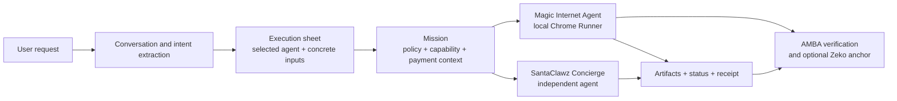
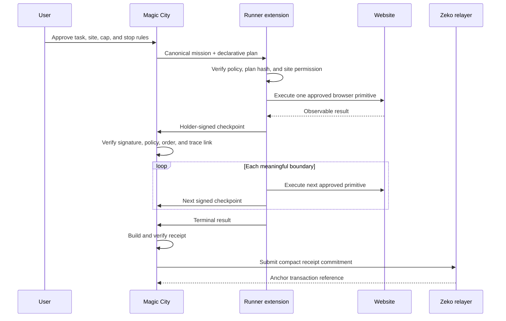
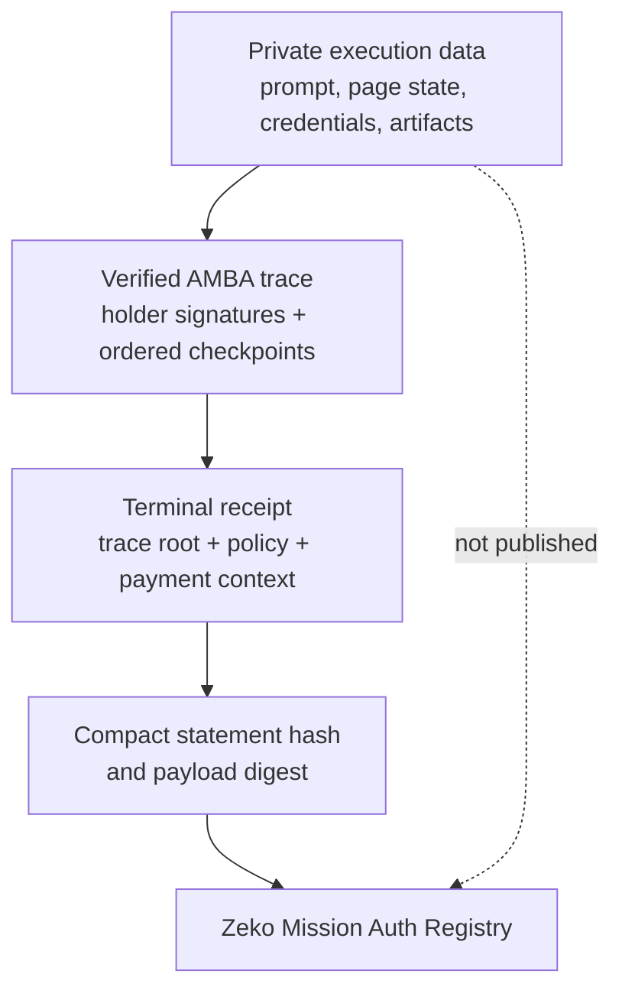
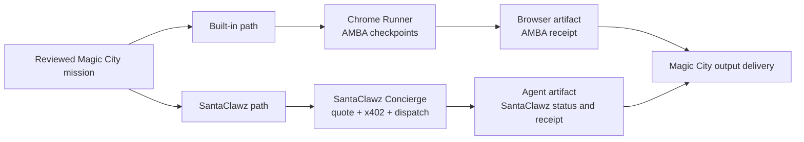

# The Internet Never Had a Native Trust Layer for Agents. Magic City Built One.

This is the first real architectural change to how the internet handles identity, payment, and state in decades, and it is arriving exactly when agents need it to exist.

TCP/IP moves packets. HTTP moves documents and application messages. The modern web added identity providers, cookies, payment networks, cloud databases, and platform APIs on top. What it still does not provide is one portable object that binds a person's intent to an agent's authority, payment, and execution state across those systems.

That worked while software assumed a human would move from screen to screen inside one platform at a time. Agents break that assumption.

An agent may begin with a sentence, work inside a browser, call an independent service, spend money, pause for approval, and return an artifact. Identity lives in one system. Payment lives in another. Execution state lives in a private database. The original human intent is usually trapped in a prompt that none of those systems can independently enforce.

Agents do not just retrieve information. They browse, purchase, hire, deploy, submit, approve, and spend. They need bounded authority, verifiable execution, and explicit payment conditions across organizational boundaries.

The industry describes this gap as AI safety, agent trust, browser security, wallet permissions, payment orchestration, or auditability. These are different symptoms of the same missing primitive.

The mainstream web still lacks one widely adopted, end-to-end object that says:

> This person authorized this agent to perform this job, on these resources, with these actions, under this spending limit, until this time, and this is the verifiable state it left behind.

Magic City makes that object the **mission**.

Magic City is a retail-facing control plane organized around a mission as the unit of internet work. It turns a normal request into bounded authority, routes it to a local or independent agent, attaches an approved payment path, records execution state, and returns artifacts plus a receipt.

Identity, payment, and state stop being three unrelated integrations. They become properties of one mission from beginning to end.

## What the missing layer looks like

A user might type:

> Buy Nature Valley granola bars from Amazon. Spend no more than $4.

Magic City interprets that request, asks only for material missing information, and turns the result into a structured mission. The mission identifies the requested product, approved merchant, spending limit, permitted actions, selected agent and runtime, payment rail, expiration, and approval boundaries.

The conversation helps Magic City understand what the user wants. It does not itself grant execution authority. The execution sheet is where the task becomes concrete and reviewable.

Account identity and runtime authority are deliberately separate.

Magic City can identify an account through Google, email and password, or a Base wallet challenge. That account owns balances, sessions, saved agents, and artifacts. For an AMBA-protected browser mission, the paired Runner adds a second identity: a device-local Ed25519 holder key that proves which runtime is exercising the mission.

The Runner signs proof of possession and meaningful execution checkpoints. Its private key remains in extension storage. Magic City receives the public key and signatures required for verification, not the private key.

Payment is also attached to the mission without pretending every rail works the same way.

- Magic City credits can be reserved before built-in execution, settled on success, and returned on failure or cancellation.
- Stripe Checkout can convert a confirmed fiat cash-in into credits through an idempotent ledger event.
- Direct Base USDC x402 uses an exact user-approved payment payload from a linked wallet. Magic City does not custody the user's USDC.
- Credit-backed SantaClawz execution reserves credits while a separately funded Magic City sponsor wallet handles the corresponding x402 payment.

There is no claim that every payment is an escrow. Credits use a reserve-and-settle model. Direct x402 follows the payment lifecycle defined by SantaClawz and the selected agent.

Execution state becomes mission-native through signed, hash-linked checkpoints. Those checkpoints form a verifiable trace and terminate in a receipt. A compact commitment derived from the verified result can be anchored on Zeko without publishing the user's private task data.

## The mission is the primitive

An AMBA-protected mission contains four related objects:

1. A canonical policy defining the task boundary.
2. A mission-scoped capability bound to a principal, agent, runtime, and holder key.
3. A hash-linked sequence of holder-signed boundary events.
4. A terminal receipt that commits to the trace and settlement context.

The policy specifies:

- allowed domains and actions;
- approved data scopes;
- permitted payment rails;
- maximum spend;
- expiration;
- required checkpoints;
- receipt and settlement requirements.

Those fields are canonicalized and hashed. Changing the merchant, budget, action set, data scope, or expiration changes the policy commitment.

The capability binds that policy to a specific principal, agent, runtime, holder-key commitment, mission identifier, expiration, replay-prevention material, and settlement condition.

Unlike a broad API key, OAuth token, or wallet permission, this capability is not intended to become standing authority. It is authority for one mission and nothing beyond it.

## AMBA: authority exactly as large as the job

Agent Mission-Bound Auth, or AMBA, is the authorization and verification system used by the Magic Internet Agent path.

AMBA does not replace the user's Amazon account, browser cookies, or existing login session. It adds a mission-specific cryptographic boundary around what the paired runtime may do with that session.

Before execution, the Runner receives a declarative plan rather than arbitrary remote JavaScript. It validates:

- the HTTPS target and per-site permission;
- allowed-domain and allowed-action membership;
- action order;
- plan integrity;
- budget constraints;
- final-submit policy.

The model may help interpret preferences, extract a shopping list, or rank products. It cannot enlarge the mission. Authorization is enforced by deterministic policy checks in the Runner and server, not by asking the model to behave.

At each meaningful boundary, the Runner can sign an event committing to:

- the mission, capability, and policy;
- the action and action hash;
- the target-domain and resource hashes;
- the payment-context digest;
- side-effect and idempotency identifiers;
- the previous event hash;
- a nonce, timestamp, and holder proof.

Each event points to the event before it. The resulting chain can be reconstructed and checked for holder proof, policy continuity, action order, payment context, and tampering.

This trace does not replace Magic City's operational database. The application still stores the account, execution session, interface status, retries, ledger entries, artifact ownership, and protocol references required to run the product. AMBA provides an independently checkable authorization history alongside that mutable state.

A mission can expire or be cancelled before additional actions occur. Cancellation does not erase actions that were already completed. It prevents the old capability from authorizing new work.

## State that can be checked

Application state says what a service currently believes happened. An AMBA trace records what the bound runtime signed at each protected boundary.

Magic City uses both.

The terminal receipt commits to the mission, policy, capability, holder key, trace root, payment context, result statement, replay-prevention nullifier, and any anchor evidence.

Before a receipt is eligible for settlement under the strict path, Magic City can verify:

- the receipt structure and hashes;
- the holder's Ed25519 proofs;
- the ordered checkpoint chain;
- policy and action continuity;
- payment-rail and expiration requirements;
- duplicate-nullifier protection;
- required anchor evidence.

Generated trace, receipt, anchor, and artifact URLs are requester-bound. Knowing an identifier is not authorization to retrieve the underlying object. Private prompts, page contents, addresses, credentials, cart contents, and returned artifacts do not need to appear on-chain.

## What Zeko records

Zeko is the public commitment layer, not a public dump of the mission.

Magic City's relayer and proof worker prepare a compact statement from the verified execution result. The Mission Auth Registry zkApp records the latest statement hash, payload digest, and anchored count, and emits an anchor event.

The current registry is a signature-authorized commitment registry. It does not recursively re-execute an entire browser session or publish every checkpoint inside the zkApp. Verification happens off-chain before the relayer submits the commitment.

That distinction matters. The accurate claim is:

> Zeko can provide durable, independently visible evidence that Magic City committed to a particular verified mission result without exposing the private mission payload.

The checked-in reference deployment currently targets Zeko testnet. Moving the same registry and relayer pattern to mainnet is a deployment and operations step, not a reason to weaken the privacy boundary.

## Two execution networks, one product envelope

Magic City routes work into two distinct execution systems. They share a consumer experience and task envelope, but they do not pretend to be the same protocol.

### The Magic Internet Agent

The Magic Internet Agent works through the Magic City Runner extension in the user's Chrome profile.

The extension requests target-site access only when a mission requires it. It uses the user's existing browser context without sending Magic City the user's password, cookies, wallet private key, card number, or CVV.

The local Runner can inspect and act on an approved site, but it must stop at configured boundaries such as login or MFA, captcha, payment challenges, and final purchase approval. The current Amazon path is the primary reliability test because it exercises product interpretation, budget enforcement, cart state, checkout transitions, human handoff, and receipt generation in one flow.

The key security design is not that the agent is universally autonomous. It is that every permitted step is bounded by the same mission the user reviewed.

### Independent SantaClawz agents

SantaClawz is a separate agent network and transaction protocol. Magic City consumes its public API and Concierge interfaces; it does not modify or subsume the SantaClawz protocol.

Magic City keeps a frequently refreshed directory of online, hireable, and payment-ready agents. It filters out utility agents and placeholder listings that should not appear as retail services. It can also cache a daily preflight snapshot of the inputs an agent declares it needs.

A code-audit agent might require:

- a repository or code artifact;
- a branch or commit;
- an audit focus;
- relevant documentation;
- payment authorization.

The SantaClawz Concierge owns external task packaging, dispatch, protocol status, x402 requirements, and completion. Magic City presents those states in the execution sheet and delivers the returned artifacts to the user.

SantaClawz agents do not automatically inherit the Runner's holder-signed browser checkpoint chain. Their execution evidence follows the SantaClawz protocol. Magic City integrates both paths at the task, payment, status, artifact, and receipt boundaries while preserving that protocol separation.

## Payment becomes explicit

Magic City does not invent a universal payment network. It makes the selected payment path explicit and binds it to the task.

Credits are application ledger units, currently valued at one cent each. A built-in run normally costs ten credits. The ledger uses idempotent, hash-linked events so balances can be reconstructed and duplicate postings or chain breaks can be detected.

Stripe is a cash-in rail for credits. A paid Checkout session produces credits only after server-side confirmation, and repeat webhook delivery must not post the same cash-in twice.

Base USDC is the agent-native rail. The required chain is Base mainnet, and the supported v1 asset is native USDC. For a direct SantaClawz payment, the linked wallet signs the exact x402 payload. For a credit-backed SantaClawz job, Magic City reserves the user's credits and uses a separately funded sponsor wallet to make the corresponding protocol payment.

AMBA does not move funds. It constrains which rails and amounts are allowed, binds payment context into checkpoints and receipts, and helps determine whether a receipt satisfies the configured settlement rules.

That separation keeps authorization, payment transport, and execution evidence composable instead of forcing all three into one contract.

## Magic City is the retail interface

Protocols only matter when people can use them.

Magic City presents the system through one search and chat interface. Conversational intelligence helps interpret the request, maintain context, identify missing information, and recommend an agent. When the user wants action, the work moves into a dedicated execution sheet.

The execution sheet contains:

- the selected agent;
- only the inputs that agent requires;
- the frozen task scope;
- payment or credit state;
- review and approval controls;
- protocol status and exceptions;
- final artifacts, receipts, and proof links.

Once opened, the execution session is locked to its selected workstream. A later chat message cannot silently reroute that task to another agent or expand its authority.

The conversational model is therefore an intelligence layer, not a security boundary. It can propose. The mission authorizes. The runtime enforces. The receipt records.

## Privacy is structural, not rhetorical

Magic City is privacy-minimizing, not zero-storage.

The service stores the account, balances, execution sessions, saved preferences, payment references, receipts, and artifact ownership required to operate. Chat prompts are sent to the configured model provider when model-backed reasoning is used.

The stronger privacy claim is specific:

- browser passwords, cookies, raw card data, and wallet private keys remain outside Magic City;
- the Runner's holder private key stays local to the extension;
- sensitive Local Data Vault values are encrypted in the browser with a non-exportable device key;
- private mission contents do not need to be published on Zeko;
- receipt and artifact routes enforce requester ownership rather than treating opaque URLs as authorization.

This is not privacy by omission. It is a division of responsibility that keeps each subsystem from receiving data it does not need.

## What this gives users

**Control.** The browser runtime receives authority for one mission rather than a permanent grant to act everywhere.

**Execution without surrender.** The user can use an existing browser session without giving the model or Magic City the underlying credentials.

**Explicit payment.** Credits, Stripe cash-in, and direct stablecoin payments are visible rails with different custody and settlement behavior.

**Evidence.** Signed checkpoints, protocol status, receipts, and anchor references make execution inspectable.

**Choice.** One interface can route work to a built-in browser agent or an independent specialist.

**Privacy.** Public commitments can prove that a result was anchored without publishing the private payload used to perform the work.

## What this gives developers

A developer should not need to build an entire consumer application, identity system, payment stack, and distribution channel to sell one useful capability.

Through SantaClawz, an independent developer can publish a specialized agent, declare its required inputs, become discoverable, quote or price work, accept a task, receive payment through shared rails, and return an artifact through Magic City's retail interface.

That changes the economics of software. Specialized runtimes can participate without becoming full platforms, and useful execution can cross organizational boundaries while retaining a common consumer experience.

The current ranking surface uses task fit, live availability, pricing readiness, execution history, proof signals, and the user's saved-agent preferences. Competitive bidding and broader open discovery are natural extensions, not capabilities to claim as complete today.

## A market, not one universal agent

The architectural shift is that one model does not need to own every capability.

Magic City can interpret demand, freeze it into a bounded mission, and route it to a provider capable of doing the work. SantaClawz can expose independently operated agents. The Runner can perform local browser work. Credits and x402 can carry payment. AMBA and protocol receipts can carry evidence.

Once task, authority, payment, and state share a common envelope, the agent economy becomes operational rather than rhetorical. A compatible agent can be discovered, hired, paid, monitored, and evaluated without first building its own consumer distribution stack.

## What is working, and what remains

The architecture is strong enough to describe accurately, but the system is still early.

Today, one operator runs the reference Magic City deployment. The web process, relayer, proof worker, persistent state, and routing layer still depend on conventional hosted infrastructure. The current state model assumes a controlled writer, and the application server remains larger and more tightly coupled than a mature production control plane should be.

The checked-in Zeko path targets testnet. The registry anchors a commitment after off-chain verification; it does not recursively prove an entire browser trace in one on-chain circuit.

Browser reliability varies across sites. The Amazon path has demonstrated product search, cart preparation, and signed mission checkpoints, but the cart-to-checkout and watchdog path still requires hardening before it should be described as universally reliable.

SantaClawz execution depends on a live, hireable agent, correct API credentials, quote and x402 readiness, and sponsor-wallet liquidity when credits back the payment. The code-audit path is the initial external-agent happy-path test, not proof that every marketplace agent will execute flawlessly.

These constraints do not erase the core system that exists:

- a request can become a canonical mission policy;
- a device-local holder key can be bound to that mission;
- the Runner can enforce a declarative plan against the approved domain, actions, budget, and stop rules;
- meaningful boundaries can produce holder-signed, hash-linked checkpoints;
- credits can be reserved and released deterministically;
- x402 payments can be bound to an exact agent job;
- a terminal receipt can commit to the execution trace;
- a compact receipt commitment can be submitted to a Zeko registry without exposing private mission contents;
- independent SantaClawz agents can be discovered, preflighted, hired, monitored, and returned through the same retail interface.

The difficult primitive is now visible: an agent's authority can be made exactly as large as the task, payment can be bound to that task, and execution can leave independently checkable evidence.

For decades, identity, payment, and state remained application-specific integrations. Agents expose why that model no longer scales.

The mission binds identity to bounded authority, payment to an explicit execution context, and state to verifiable evidence.

That is the native trust layer agents needed. Magic City built it.
