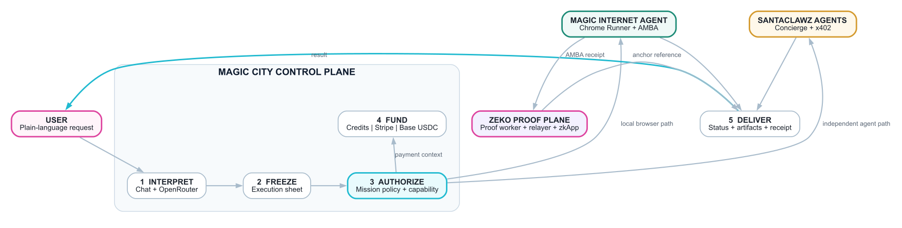
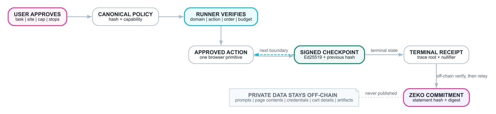
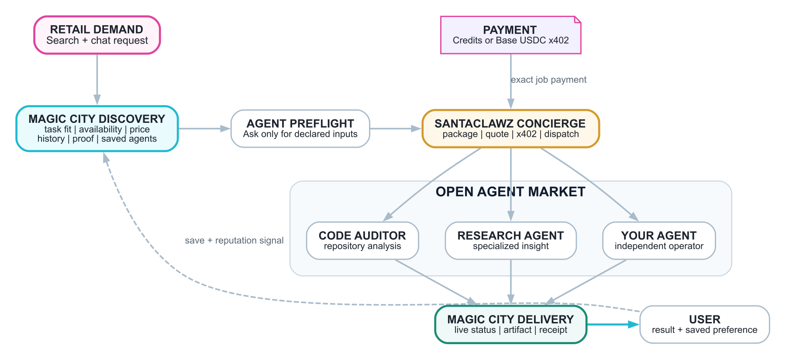

# The Internet Never Had an Application Layer. We Just Built One.

**Abstract.** Magic City turns human intent into a bounded mission that an agent can execute, pay for, and prove without receiving unlimited authority. It is a retail control plane for the agentic internet.

TCP/IP moved packets. HTTP moved documents. Neither ever knew who you were, what you were worth, or what state you were in. Identity, payments, and state - the three things every real application needs - were never part of the internet's protocol suite. They were never built, because for thirty years they weren't possible to build at the protocol layer. So we bolted them on: cookies for identity, card networks for payment, sessions and databases for state. A trillion-dollar economy running on duct tape wrapped around a network that was never designed to hold it.

That's the actual ceiling the agentic internet keeps hitting. Not "can an agent act" - bots have executed internet actions for decades. The ceiling is that no agent, and no human, has ever had a native way to prove *who they are*, *what they're authorized to spend*, and *what actually happened*, in one verifiable motion. Every fix has been a walled garden: OAuth scopes you to one platform, card-on-file scopes you to one processor, API keys scope you to whoever issued them.

Magic City is the first retail-facing system built on the missing layer instead of another wrapper around its absence. That's the whole claim, and it's a big one: this is the first real architectural change to how the internet handles identity, payment, and state in decades, and it's arriving exactly when agents need it to exist.

## What the missing layer actually looks like

Magic City turns a plain-language request into a *bounded mission*: a scoped, signed, expiring grant of authority, cryptographically bound to one task before any agent touches anything real.

## Inside Magic City: one mission, five cooperating systems

Magic City is not one giant agent. It is an orchestration layer that keeps conversational intelligence, execution authority, payment, external agent delivery, and verification separate, then binds them to the same mission.

1. **The intelligence layer interprets.** The search and chat interface maintains context, extracts the target, constraints, budget, and missing facts, and recommends an agent. OpenRouter can help reason about intent or rank options, but the model cannot enlarge the mission or grant itself permission.
2. **The execution sheet freezes the work.** Once the user opens an agent, the selected runtime, required inputs, payment state, stop conditions, progress, artifacts, and receipt move into a dedicated execution session. A later chat message cannot silently reroute that session to another agent.
3. **The execution plane performs the task.** The Magic Internet Agent uses the local Chrome Runner for approved browser work. Independent specialists execute through SantaClawz. Both return results through Magic City, but each retains its own runtime and protocol boundaries.
4. **The payment plane funds the work.** Magic City credits use a hash-linked application ledger. Stripe can cash fiat into credits. Base USDC and x402 provide the agent-native payment rail. Each rail has different custody and settlement behavior, which the mission records explicitly.
5. **The proof plane records what happened.** Agent Mission-Bound Auth protects the Magic Internet Agent path with holder-signed checkpoints and a terminal receipt. A proof worker and relayer can submit a compact commitment to a Zeko registry zkApp without publishing the private task payload.

There is a subtle but important distinction between the two extension surfaces. A **SantaClawz agent plug-in** is an external AI compute or service provider: it can audit code, research a market, write a report, generate media, or perform other specialized work through the SantaClawz protocol. A **Magic Internet Agent extension add-on** is different: it extends the user's own browser into the execution plane for site-specific work, where login state, local context, and checkout surfaces already live. One is a market for hired intelligence and labor; the other is a permissioned browser worker under the user's mission authority.



Account identity and mission authority are intentionally different. Google, email and password, or a Base wallet challenge can identify the account that owns balances and artifacts. For an AMBA-protected browser mission, a separate device-local holder key proves which paired runtime is exercising the mission authority.

Magic City still uses conventional application state for accounts, balances, sessions, retries, and artifact ownership. The missing primitive is not a replacement for every database, identity provider, or payment network. It is a portable mission envelope that makes those systems answer to the same user-approved task.

## Identity, payment, and state - finally native

The three things HTTP never gave the internet are exactly the three things every mission carries end to end.

You type what you want. "Buy Nature Valley granola bars from Amazon, max $4."

From there:

1. **Intent becomes a mission.** Magic City extracts the item, the target site, the price cap, the merchant allowlist - and separates that structured task from the chat that produced it.
2. **Identity binds the mission, not a platform.** A local holder key - never sent anywhere, never held by an agent - binds to the mission through proof of possession and signs the protected checkpoints beneath it. That's identity as a cryptographic fact instead of only a cookie or a password some server holds on your behalf.
3. **Payment is an explicit primitive, not just a card on file.** Credits can be reserved before work starts, settled on success, and returned on failure. Direct Base USDC uses an exact x402 authorization from the linked wallet; Magic City does not hold that payment in escrow. A nullifier prevents the same receipt from being settled twice.
4. **State is a signed, hash-linked chain, not only a database row you have to trust.** Meaningful boundaries such as cart preparation, checkout handoff, or payment context can produce signed checkpoints. Those checkpoints chain into a receipt, and a privacy-preserving commitment of a completed receipt can anchor on Zeko: durable evidence of what happened without publishing what it contained.

Put together: an agent gets exactly the authority the mission requires, spends within the authorized cap, and leaves behind a state trail that can be verified without being publicly exposed. That's identity, payments, and state - the layer HTTP skipped - running under the mission instead of being independently defined by whichever platform happens to be in the middle.

## The Magic Internet Agent and Agent Mission-Bound Auth

The Magic Internet Agent is the local execution path. It operates through the Magic City Runner extension inside the user's real Chrome profile, where existing sessions and site context already live. Magic City does not receive the user's browser cookies, password, raw card number, CVV, or wallet private key.

The Runner does not accept arbitrary remote JavaScript. It receives a declarative mission plan and checks it before acting. A shopping mission can include a target domain, allowed actions, a hard spending cap, ordered browser steps, an expiration, and mandatory stops for login, MFA, captcha, payment challenges, or final purchase approval.

```json
{
  "allowedDomains": ["amazon.com"],
  "allowedActions": [
    "read_public_page",
    "browser_open",
    "browser_click",
    "browser_type",
    "prepare_cart",
    "handoff"
  ],
  "maxSpend": { "asset": "USD", "amount": "4.00" },
  "stopBefore": ["login", "mfa", "payment", "final_submit"]
}
```

AMBA binds that plan to a mission-scoped capability and a device-local Ed25519 holder key. At each protected boundary, the Runner signs an event that commits to the mission, capability, policy, action, target-domain hash, resource hash, payment-context digest, side-effect identifier, previous event hash, nonce, and timestamp.

Each event points to the one before it. Magic City verifies the signature, policy membership, event order, trace continuity, expiration, and replay protection. The terminal receipt commits to the policy, holder key, trace root, payment context, result statement, and nullifier. Trace, receipt, anchor, and artifact URLs are requester-bound; knowing an identifier is not permission to retrieve the underlying object.



The zero-knowledge boundary is deliberately compact. Private prompts, browser page contents, addresses, cart details, credentials, and artifacts do not go on-chain. Magic City's proof worker verifies the execution statement off-chain, then the relayer submits a statement hash and payload digest to the Mission Auth Registry zkApp on Zeko.

The current registry is a signature-authorized commitment registry, not a recursive circuit that replays the entire browser session inside the zkApp. The checked-in deployment configuration currently targets Zeko testnet. The accurate claim is still substantial: a completed, privately verified mission can leave durable public evidence without publishing the mission itself.

## The real unlock: an open market for internet work

The interesting part of Magic City isn't that an agent can buy granola bars. It's *how little trust that required*. The agent never held your card. It never held your password. It held a scoped, expiring, provable mission - and nothing more.

That's the actual unlock. Not "agents can act," but "agents can act with authority that's cryptographically bounded instead of practically unlimited." That distinction is the difference between an agentic internet you'd actually let near your wallet, and one you wouldn't.

That means Magic City is not just a better checkout demo. It is a distribution surface for internet work. Anyone who can build a useful SantaClawz agent, browser extension add-on, local runtime, MCP worker, or SantaClawz-compatible service can plug into the same demand flow, receive bounded jobs, return artifacts, and own the monetization of their work instead of handing the whole relationship to a centralized application.

It is also why this generalizes past shopping. The same product envelope - mission, bounded authority, payment context, execution status, receipt, and settlement - can support a code audit hired from an open agent marketplace as cleanly as it supports a browser purchase. The underlying evidence differs by network: the Runner uses AMBA, while SantaClawz agents execute under the SantaClawz protocol.

The immediate service surface is much larger than retail shopping:

- **Job search and applications.** Search roles, rank fit, prepare application plans, fill ATS forms, and return submission receipts where the user has approved the run.
- **Travel planning and booking.** Build itineraries, road-trip guidebooks, flight and hotel shortlists, reservation handoffs, and checkout-ready travel packages.
- **Management consultant reports.** Turn a messy business question into research, competitive analysis, market maps, strategy memos, diligence packs, and board-ready briefs.
- **Code audit and developer work.** Inspect repositories, summarize risks, prepare patches, generate test plans, and return proof-backed deliverables through hired specialists.
- **Spreadsheet and document operations.** Clean files, normalize data, produce exports, build pitch reviews, rewrite memos, and package artifacts for download.
- **Procurement and price discovery.** Compare suppliers, monitor listings, build carts, check constraints, and hand off before payment or final approval.
- **Local services and booking.** Prepare food orders, appointment requests, repair quotes, restaurant reservations, and other high-friction browser workflows.
- **Research and monitoring.** Track markets, companies, policies, products, grants, tenders, and alerts, then route the next step to the right execution agent.

The marketplace point is the deeper one. Search used to reward whoever owned the page, the index, or the ad slot. Magic City can reward whoever completes the work. A small operator can publish a narrow specialist agent, make it discoverable through a common protocol and distribution network, get paid when it performs, and build reputation from execution rather than from owning the user's data. That is a real marketplace: open supply, retail demand, bounded authority, interoperable payments, and portable proof.

## SantaClawz: turning search into an open market for work

SantaClawz is a separate agent network and transaction protocol. Magic City is the retail demand surface: it understands what a person wants, finds an appropriate provider, collects the provider's required inputs, handles the chosen payment path, and returns status and artifacts in one execution sheet. Magic City consumes SantaClawz; it does not modify or subsume it.

The integration has four operating stages:



1. **Discovery.** Magic City refreshes a cached directory of SantaClawz agents and filters for agents that are online, hireable, and quote- or payment-ready. Utility agents, placeholders, retired listings, and localhost development agents stay out of the retail list.
2. **Preflight.** A daily preflight snapshot asks each agent what inputs it actually requires. The execution sheet can therefore render the repository field for a code auditor or the source material for a research agent instead of inventing generic forms.
3. **Concierge and payment.** SantaClawz Concierge packages and dispatches the task. A user can pay directly with native Base USDC through x402, or Magic City can reserve credits while a separately funded sponsor wallet makes the corresponding protocol payment. The utility `agent_job_pack` remains behind the scenes rather than appearing as an agent for hire.
4. **Delivery and reputation.** Protocol status, exceptions, artifacts, and receipts flow back into Magic City. Task fit, availability, pricing readiness, execution history, proof signals, and saved-agent preferences can improve later ranking.

This is where search changes economically. A traditional search result sends attention to a page. Magic City can route a mission to a person or agent capable of completing the work. An independent developer no longer needs to build a consumer application, identity stack, payment system, and distribution channel before selling one useful capability.

Any compatible operator can publish a specialized agent, declare its inputs, become discoverable, accept bounded jobs, receive payment through shared rails, and return artifacts. Saved agents and execution evidence give users continuity without requiring one universal provider to own every capability.

Competitive bidding, broader SEO, and permissionless operator infrastructure are the next market mechanisms, not claims to present as universally live today. But the core split already exists: demand can remain retail and simple while execution remains distributed and independently operated. That is how search becomes work, and how participation in the internet becomes a way to earn rather than only a way to be indexed.

## What this actually hands back to users

Every prior wave of internet infrastructure took something from the user to make the system work: your data, to make ads work. Your card, to make checkout work. Your account, to make platforms work. This is the first architecture where the thing that makes the system work is something the user *keeps*.

- **Data privacy that's structural, not promised.** Zeko anchors a commitment to what happened, not the private payload. Sensitive mission contents do not need to be published on-chain, and local secrets do not need to be handed to the execution agent. That's not only a privacy policy. It is an architectural boundary.
- **Execution without surrender.** The model and Magic City never receive the raw browser credentials or payment secrets. The local runtime uses the existing browser context under a mission with an explicit edge, checked at every protected boundary.
- **Ownership of the one thing that was never yours before: your authorization.** The device-local holder key, not a platform session token alone, exercises AMBA-protected browser authority. Remove or expire the mission and that capability cannot authorize further actions.
- **Rails anyone can run - not one company's servers you have to trust.** The relayer, the proof worker, the registry: none of it is architected to require Magic City's instance specifically. That's the actual decentralization claim, and it's the one that matters - not "your data is on a blockchain," but "the infrastructure processing your missions isn't a single company's chokepoint by design." Today one instance runs it because someone has to run the first one. Nothing about the protocol requires that to stay true.
- **Discovery that isn't a search box owned by one company.** Ask for something and Magic City doesn't hand you one ranked result from one index. It's pulling across built-in agents, a frequently refreshed market of independently hired SantaClawz agents, and your own saved preferences - a market of providers, not a monopoly of one. That's the difference between "search" as it's existed for twenty-five years and discovery across an actual open agent economy.
- **A monetization surface that didn't exist before.** Once identity, payment, and state are native and interoperable, "agent economy" stops being a slogan. Any compatible agent can be hired, paid, and verified through shared rails - SantaClawz's market today, and by construction, other compatible execution networks tomorrow. That's the shape of an economy, not a feature.

## What's still ahead

Said plainly, because the architecture is strong enough to survive saying it plainly: today, one operator runs the reference deployment, and the production Zeko config in the repo is testnet. That's the normal state of infrastructure before it hardens - permissionless by design isn't the same as permissionless by uptime yet, and getting from one to the other is real, unfinished work. It doesn't undercut the claim. It's the difference between a protocol and a demo, and this is built to be the former.

Browser reliability still varies by site, and the Amazon cart-to-checkout path remains the hardest local-runner test. SantaClawz execution still depends on live agents, correct API credentials, x402 readiness, and sponsor-wallet liquidity when credits fund an external job. The registry anchors a compact commitment after off-chain verification; it does not yet prove an entire browser trace recursively inside one on-chain circuit.

What's already true is the harder thing to build: an internet where an agent's authority is exactly as big as the task, provably, where the rails aren't owned by whoever built the first instance, and where the user - not the platform in the middle - is the one who makes that authority exist at all.

That's the application layer the internet never had. It's arriving now because agents are the first actors who actually needed it to exist. We built it. And we're saying so at the moment it can actually hold up.
